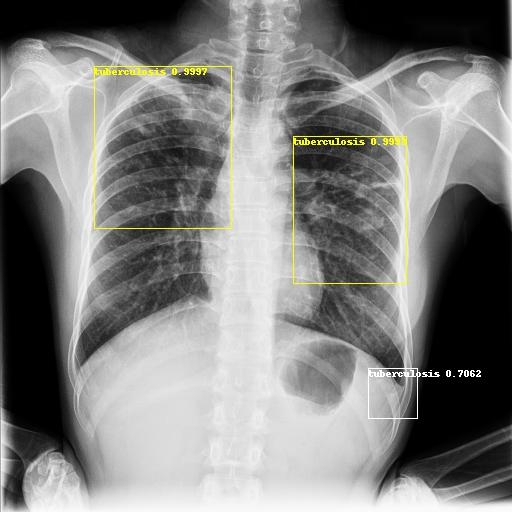

# TB X-ray Faster-Rcnn in Pytorch
- An implementation of [Faster R-CNN](https://arxiv.org/pdf/1506.01497.pdf) in PyTorch.
- Only python source. These is no need to compile nms and roialign cpp
- Comment in many functions
- [Pycharm IDE](https://www.jetbrains.com/pycharm/download/other.html) can set breakpoint in any line on cpu mode
- If you want to debug on cuda mode set kwargs={} in train.py

# Demo: Real vs AI-Detect
 

## Prepare install
- cd tb_faster_rcnn
- ./install_data.sh
- mirror site: https://www.mediafire.com/file/j6j3414nb6pye5b/tb_data.tar.gz

## Run
- python3 ./train.py --cuda True
- python3 ./train.py --cuda True --resume True
- python3 ./train.py --backbone resnext101_32x8d --cuda True --resume True
- python3 ./infer.py --cuda True
- python3 ./infer.py --backbone resnext101_32x8d --cuda True
- python3 ./eval.py --cuda True
- python3 ./eval.py --backbone resnext101_32x8d --cuda True

## Performance
- Intel I7-3770K(118US$) + GeForce GTX 1650 4GB(220US$)
- Ubuntu 16.04 + Python 3.7.9
- CUDA version 10.2
- Resnet-101
- Train 1.8 frames per second
- Infer 2.7 frames per second

## Pretrained download
- (a)Using resnet101 training 699 samples at 28 epochs meanAP is 0.7701
- 
- pretrained file https://drive.google.com/file/d/1cWgVyKYmAA8TxtVWQEdURvKGWK-DnWyt
- (b)Using resnext101_32x8d training 699 samples at 31 epochs meanAP is 0.7859
- 
- pretrained file https://drive.google.com/file/d/1KEe3OHhDDGjWa7tqugpTXhcgs924Z5mZ
- copy to ./checkpoint & Rename to model-last.pt

# Data preparation tutorials
- You can add [class name] in CATEGORY_TO_LABEL_DICT of voc2007.py
- [class name] also under "name" tag in ./data/VOCdevkit/VOC2007/Annotations/*.xml
- sudo apt install libxcb-xinerama0 && pip3 install labelImg && labelImg can edit image label
- Tag format explain in [VOC2007](https://towardsdatascience.com/coco-data-format-for-object-detection-a4c5eaf518c5)

# Train skill
- Minimum loss not indicate high accuracy
- WEIGHT_DECAY avoid too fit. The bigger weight, the more attenuation
- UPDATE_LR_FREQ is learning rate attenuation times in each epoch 
- If your hard disk big enough set NUM_SAVE_EPOCH_FREQ = 1
- Rename 10~30 checkpoint one after one to model-last.pt and run eval.py to get the maximum meanAP and minimum loss

## Web site
- http://fatalfeel.blogspot.com/2013/12/faster-rcnn-in-pytorch.html
- http://fatalfeel.blogspot.com/2019/12/ai-with-cuda-install-step-and-yolov3-in.html

## Refer to
- https://www.kaggle.com/zeeshanshaik75/tb800imagesmasks
- https://www.mediafire.com/file/r5j10i5b4068feb/Yet-Another-EfficientDet-Pytorch-voc2007.tar.gz
- thanks potterhsu0818@gmail.com for code base
